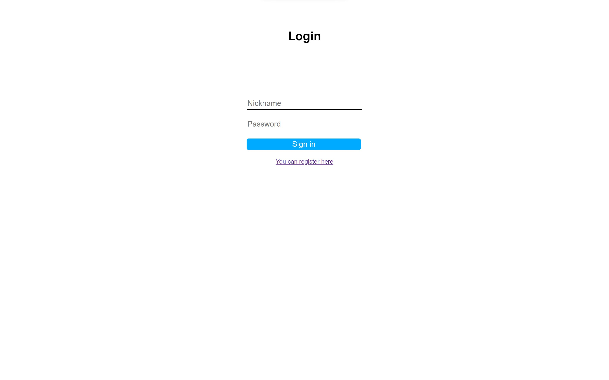
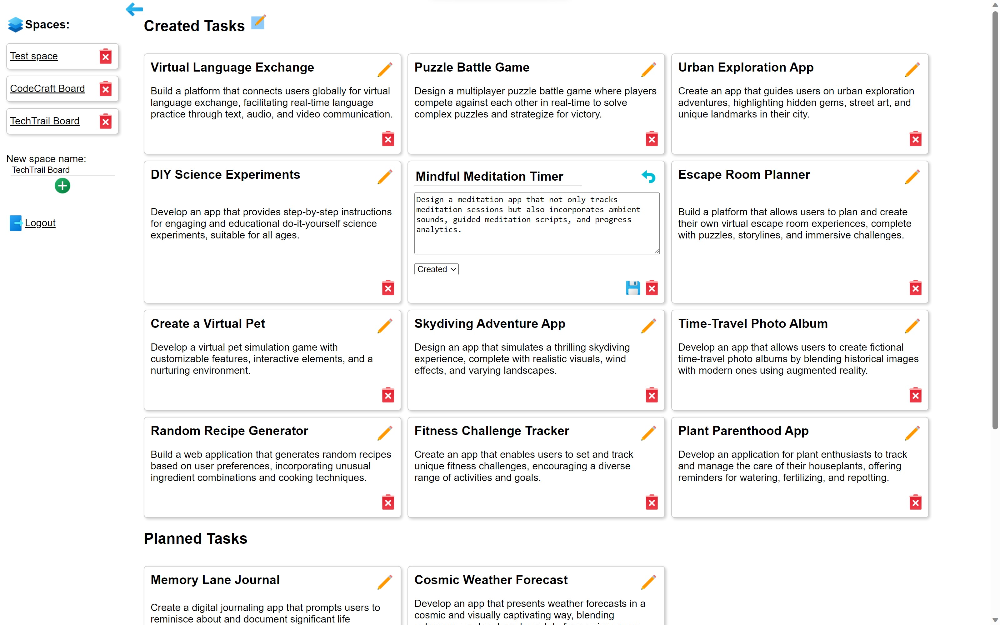
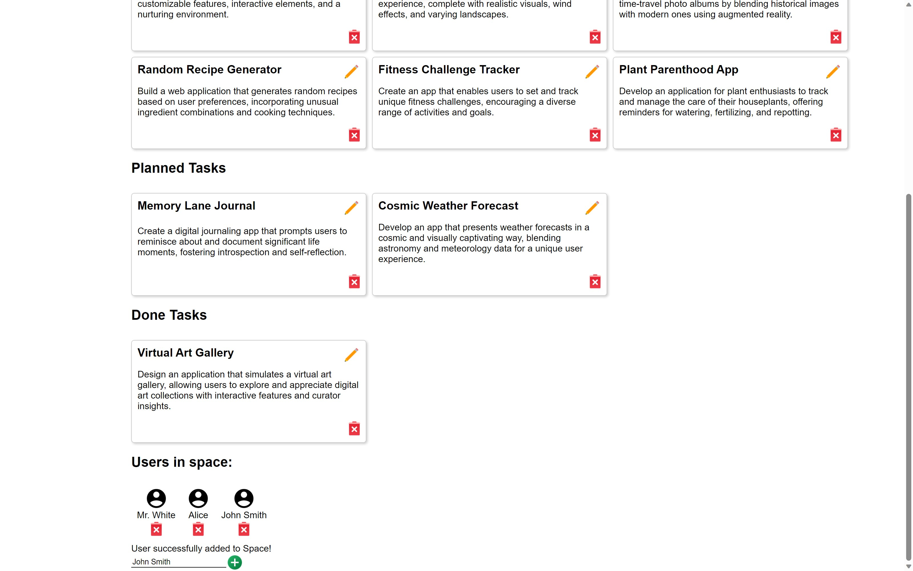
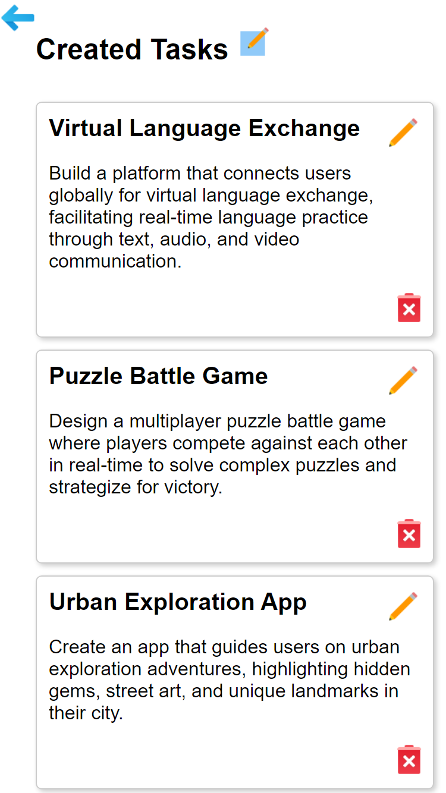

# Demo project
Frontend for Kanban-board multi-user system based on React, React-router.
## You can:
- Create/Remove Spaces</li>
- Create/Remove other users into spaces</li>
- Create/Edit/Remove tasks for spaces

## Login screen

## Main screen 2

## Main screen 2

## Main screen (mobile)

A non-profit project
